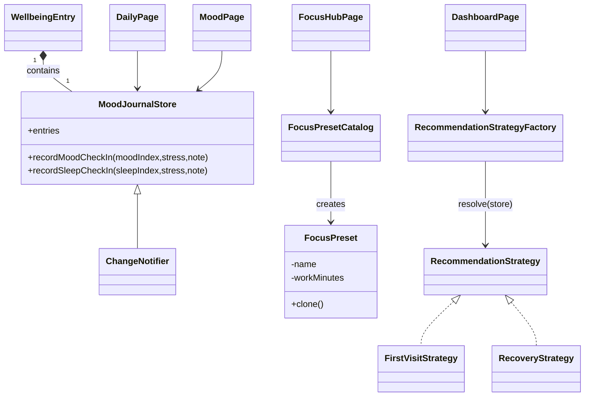

# Mental-Sleep Hub — Sunum Özeti

Bu doküman sunum sırasında kullanabileceğin kısa notları, UML diyagramını, her pattern için 30 saniyelik açıklamayı ve demo adımlarını içerir.

**Dosyalar**
- Kod: [lib/core/patterns/observer/mood_journal_store.dart](lib/core/patterns/observer/mood_journal_store.dart#L1-L220)
- Prototype: [lib/core/patterns/prototype/focus_preset.dart](lib/core/patterns/prototype/focus_preset.dart#L1-L220)
- Strategy/Factory: [lib/core/patterns/strategy/recommendation_strategy.dart](lib/core/patterns/strategy/recommendation_strategy.dart#L1-L220)
- Demo akış: [lib/features/dashboard/presentation/daily_page.dart](lib/features/dashboard/presentation/daily_page.dart#L1-L120)

---

**UML — Basit sınıf diyagramı (Mermaid)**

---

**Pattern'ler — 30 saniyelik konuşma notları**

- Observer (30s): "Daily ekranındaki kayıtlar merkezi `MoodJournalStore`'a yazılıyor. `MoodJournalStore` bir `ChangeNotifier` ve Riverpod provider ile uygulama genelinde gözlemleniyor; örneğin `MoodPage` ve `DashboardPage` otomatik olarak güncelleniyor. Bu, Observer pattern'in tipik kullanımına denk gelir: veri kaynağı -> aboneler."

- Prototype (30s): "Odak preset'leri `FocusPreset` olarak tanımlandı ve `clone()` metodu sayesinde hızlıca kopyalanıp uygulanabiliyor — yeni preset türetmeye gerek kalmadan var olan ayarları çoğaltıp değiştirebiliyoruz. Bu Prototype pattern'inin küçük ve savunulabilir bir örneğidir."

- Strategy + Factory (30s): "Dashboard öneri kartı için bir `RecommendationStrategy` arabirimi var; farklı stratejiler (FirstVisit, Recovery, Momentum, vb.) store durumuna göre seçiliyor. `RecommendationStrategyFactory` uygun stratejiyi üretiyor — Strategy ile davranışı soyutladık, Factory ile seçim mantığını izole ettik."

---

**Demo adımları (3-4 dk gösterim)**

1. Uygulamayı çalıştır: `flutter run` (Tercihen emulator veya debug on device).
2. Splash -> Onboarding ile giriş.
3. `Günlük / Daily` ekranına gel: Ruh hali sekmesini seç, bir emoji seç, not ve stres seviyesi girip `Kaydet` tuşuna bas.
4. `Ruh Hali / Mood` ekranına git: yeni kaydın canlı olarak listelendiğini, özet kartların güncellendiğini göster (Observer çalışıyor).
5. `Dashboard` ekranına dön: öneri kartı içeriklerinin `RecommendationStrategy` tarafından seçildiğini göster.
6. `Odak / Focus` ekranına git: preset listesinden bir preset seç, preset'in çalışma/dinlenme sürelerini değiştir ve `Başlat` ile preset'in uygulandığını göster (Prototype).

---

Ek not: kod repository'sine kısa README açıklaması eklendi: [README.md](README.md#L1-L40)

İstersen bunu doğrudan sunum slaytlarına dönüştüreyim (PowerPoint/Google Slides iskeleti veya kısa 6 slaytlık markdown).
